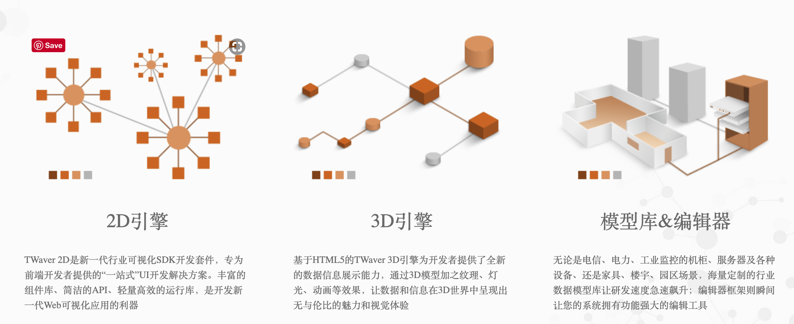
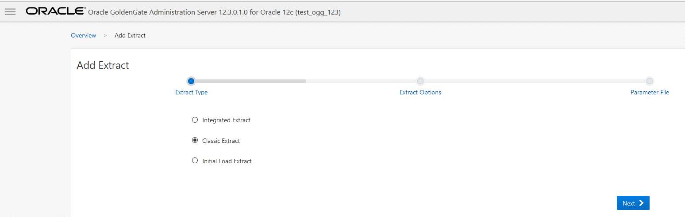
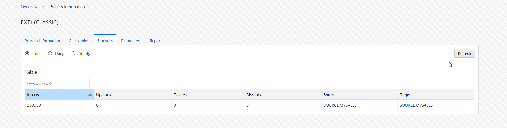

[Ansible](#ansible)
- [什么是Ansible?](#什么是ansible)
- [为什么选择Ansible?](#为什么选择ansible)
    - [*简单、强大、无代理*](#简单强大无代理)
    - [*易于集成 插件丰富*](#易于集成-插件丰富)
- [Ansible如何工作？](#ansible如何工作)
    - [组件调用关系](#组件调用关系)
    - [简单示例](#简单示例)

[Twaver.js](#twaverjs)
 - [简单示例](#简单示例)
 - [应用示例](#应用示例)

[OGG](#ogg)
   - [入门介绍](#入门介绍)
   - [逻辑结构](#逻辑结构)
   - [架构演变-OGGMA](#架构演变-oggma)
   - [简单示例](#简单示例-2)
   
[SpringBoot+Vue(Jeecg-boot)](#springbootvuejeecg-boot)

# Ansible
## 什么是Ansible?
Ansible是近年越来越火的一款运维自动化工具，其主要功能是帮忙运维实现IT工作的自动化、降低人为操作失误、提高业务自动化率、提升运维工作效率，常用于软件部署自动化、配置自动化、管理自动化、系统化系统任务、持续集成、零宕机平滑升级等。
## 为什么选择Ansible?
### *简单、强大、无代理*


### *易于集成 插件丰富*


[点击这里查看内置插件列表](https://docs.ansible.com/ansible/latest/modules/modules_by_category.html)

## Ansible如何工作？


用户通过ansible去管理各个主机，那么ansible就是我们所说的主控端，后面的Host为被控端。
在控制主机时，ansible是如何知道哪些主机是被自己控制的呢？
这就需要一个Host Inventory（主机清单），用于记录ansible可以控制网络中的哪些主机。另外，要配置和管理这些主机，可以采用两种方式，一种是单一的命令实现，另外一种也可以使用palybook实现。单一的命令模式是采用不同的模块进行管理，一个模块类似于一些管理的命令，如top，ls，ping等等，适用于临时性的操作任务。如果需要执行一些例行性或经常性的操作，则需要采用playbook的方式，playbook类似于一个脚本，将多个模块按一定的逻辑关系进行组合，然后执行。ansible还支持一些插件，如邮件、日志等，在和远程主机通信时，也会采用类似的连接插件，这里使用则是SSH协议的插件进行通信.

根据Ansible使用过程中的不同角色，我们将其分为：
* 使用者
* Ansible工具集
* 作用对象

1. 使用者 

第一种方式：CMDB（Configuration Management Database，配置管理数据库）, CMDB存储和管理着企业IT架构中的各项配置信息，是构建ITIL项目的核心工具，运维人员可以组合CMDB和Ansible，通过CMDB直接下发指令调用Ansible工具集完成操作者所希望达成的目标；

第二种方式：PUBLIC/PRIVATE方式，Ansible除了丰富的内置模块外，同时提供丰富的API语言接口，如PHP、Python、PERL等多种当下流行语言，基于PUBLIC（公有云）/PRIVATE（私有云）, Ansible以API调用的方式运行；

第三种方式：USERS直接使用Ad-Hoc临时命令集调用Ansible工具集来完成任务执行， Ad-Hoc将在第3章有详细介绍；

第四种方式：USERS预先编写好的ANSIBLE PLAYBOOKS，通过执行Playbooks中预先编排好的任务集按序完成任务执行。

2. Ansible工具集

ansible命令是Ansible的核心工具，ansible命令并非自身完成所有的功能集，其只是Ansible执行任务的调用入口，大家可心理解为“总指挥”，所有命令的执行通过其“调兵遣将”最终完成。ansible命令共有哪些兵将可供使唤呢？大家看中间绿色框中有INVENTORY（命令执行的目标对象配置文件）、API（供第三方程序调用的应用程序编程接口）、MODULES（丰富的内置模块）、PLUGINS（内置和可自定义的插件）这些可供调遣

3. 作用对象

Ansible的作用对象，不仅仅是Linux和非Linux操作系统的主机（HOSTS），同样也可以作用于各类公有云/私有云，商业和非商业设备的网络设施。

同样，如果我们按Ansible工具集的组成来讲，由上图可以看出Ansible主要由6部分组成。

* ANSIBLE PLAYBOOKS：任务剧本（任务集），编排定义Ansible任务集的配置文件，由Ansible顺序依次执行，通常是JSON格式的YML文件；
* INVENTORY:Ansible管理主机的清单；
* MODULES:Ansible执行命令的功能模块，多数为内置的核心模块，也可自定义；
* PLUGINS：模块功能的补充，如连接类型插件、循环插件、变量插件、过滤插件等，该功能不常用。
* API：供第三方程序调用的应用程序编程接口；
* ANSIBLE 组合INVENTORY、API、MODULES、PLUGINS,可以理解为是Ansible命令工具，其为核心执行工具。


## 组件调用关系

使用者使用Ansible或Ansible-playbook（会额外读取Playbook文件）时，在服务器终端输入Ansible的Ad-Hoc命令集或Playbook后，Ansible会遵循预先编排的规则将Playbooks逐条拆解为Play，再将Play组织成Ansible可识别的任务（Task），随后调用任务涉及的所有模块（Module）和插件（Plugin），根据Inventory中定义的主机列表通过SSH（Linux默认）将任务集以临时文件或命令的形式传输到远程客户端执行并返回执行结果，如果是临时文件则执行完毕后自动删除。

## 简单示例

1. 下载docker容器镜像
```
docker pull chusiang/ansible-managed-node:ubuntu-14.04
```
2. 创建docker测试节点容器
```
docker run --name server1 -d -P chusiang/ansible-managed-node:ubuntu-14.04

docker run --name server2 -d -P chusiang/ansible-managed-node:ubuntu-14.04
```
3. 创建管理节点容器
```
 docker pull chusiang/ansible-jupyter:ubuntu-14.04

 docker run --name jupter -p 8888:8888 -d chusiang/ansible-jupyter:ubuntu-14.04
```

4. 查看容器状态
```
docker ps
```
5. 进入容器
```
docker exec -it server1 bash 
```
6. 访问浏览器进行jupter文件修改
http://localhost:8888

7. 修改Inventory
```
# ============================================================
#  Author: Chu-Siang Lai / chusiang (at) drx.tw
#  Blog: http://note.drx.tw
#  Filename: inventory
#  Modified: 2017-11-10 00:13
#  Description: The managed nodes list for Ansible.
#
#   Syntax:
#
#     <servername>  <options>
#     debian-8      ansible_ssh_host=192.168.1.109  ansible_ssh_port=32788
#
#   Common Option:
#
#     `ansible_ssh_host`: Remote host IP.
#     `ansible_ssh_user`: Remote ssh username.
#     `ansible_ssh_private_key_file`: ssh private key path.
#     `ansible_ssh_port`: ssh port.
#     `ansible_ssh_pass`: ssh password. (Not recommended)
#
#∏  Reference: http://docs.ansible.com/ansible/latest/intro_inventory.html
# ============================================================

# Host & Group
##############

[ubuntu]
server1   ansible_ssh_host=191.168.2.54  ansible_ssh_port=32790
server2   ansible_ssh_host=191.168.2.54  ansible_ssh_port=32791

# Group of Group
################

[test:children]
ubuntu

# vim: ft=ansible :

```
8. 修改ansible.cfg
```
inventory = inventory
remote_user = docker
private_key_file = ~/.ssh/id_rsa
host_key_checking = False
retry_files_save_path = ./ansible-retry
```

9. 用Jupter执行测试命令
```
!ansible all -m command -a "echo hello world"
```

# Twaver.js


## 简单示例
[基本元素-节点 连线](file:///Users/woody/develop/twaver/twaverdemo/twaverdemo/twaver/demo1.html)

[层级-分组](file:///Users/woody/develop/twaver/twaverdemo/twaverdemo/twaver/demo3.html)

[提示标注-静态](file:///Users/woody/develop/twaver/twaverdemo/twaverdemo/twaver/demo5.html)

[提示标注-动态](file:///Users/woody/develop/twaver/twaverdemo/twaverdemo/twaver/demo7.html)

[提示标注-HTML](file:///Users/woody/develop/twaver/twaverdemo/twaverdemo/twaver/demo_p23.html)

[属性表格](file:///Users/woody/develop/twaver/twaverdemo/twaverdemo/twaver/demo_p24.html)

[页面布局](file:///Users/woody/develop/twaver/twaverdemo/twaverdemo/twaver/demo_p42.html)

[工具栏](file:///Users/woody/develop/twaver/twaverdemo/twaverdemo/twaver/demo_p59.html)

[拓扑方式](file:///Users/woody/develop/twaver/twaverdemo/twaverdemo/twaver/demo_p68.html)

[鸟撖图](file:///Users/woody/develop/twaver/twaverdemo/twaverdemo/twaver/demo_p82.html)


# 应用示例


# OGG

## 入门介绍
Oracle GoldenGate 简称OGG，是一种基于日志的结构化数据复制软件。GoldenGate 能够实现大量交易数据的实时捕捉、变换和投递，实现源数据库与目标数据库的数据同步，保持亚秒级的数据延迟。

GoldenGate能够支持多种拓扑结构，包括一对一，一对多，多对一和双向复制等等。


## 逻辑结构


1. Manager
顾名思义、Manager进程是Golden Gate中进程的控制进程，用于管理 Extract，Data Pump，Replicat等进程,在 Extract、Data Pump、Replicat 进程启动之前，Manager 进程必须先要在源端和目标端启动
在整个 Golden Gate 运行期间，它必须保持运行状态
    * 监控与启动 GoldenGate 的其它进程
    * 管理 trail 文件及 Reporting

2. Extract
Extract 进程运行在数据库源端上，它是Golden Gate的捕获机制，可以配置Extract 进程来做如下工作：
    * 初始数据装载：对于初始数据装载，Extract 进程直接从源对象中提取数据
    * 同步变化捕获：保持源数据与其它数据集的同步。初始数据同步完成后，Extract 进程捕获源数据的变化；如DML变化、 DDL变化等

3. Replicate
 Replicat 进程是运行在目标端系统的一个进程，负责读取 Extract 进程提取到的数据（变更的事务或 DDL 变化）并应用到目标数据库,就像 Extract 进程一样，也可以配置 Replicat 进程来完成如下工作：
    * 初始化数据装载：对于初始化数据装载，Replicat 进程应用数据到目标对象或者路由它们到一个高速的 Bulk-load 工具上
    * 数据同步:将 Extract 进程捕获到的提交了的事务应用到目标数据库中

4. Collector
Collector 是运行在目标端的一个后台进程,接收从 TCP/IP 网络传输过来的数据库变化，并写到 Trail 文件里。
    * 动态 collector：由管理进程自动启动的 collector 叫做动态 collector，用户不能与动态 collector 交互
    * 静态 collector：可以配置成手工运行 collector，这个 collector 就称之为静态 collector

5. Trails
 为了持续地提取与复制数据库变化，GoldenGate 将捕获到的数据变化临时存放在磁盘上的一系列文件中，这些文件就叫做 Trail 文件,这些文件可以在 source DB 上也可以在目标 DB 上，也可以在中间系统上，这依赖于选择哪种配置情况,在数据库源端上的叫做 Local Trail 或者 Extract Trail；在目标端的叫做 Remote Trail。

 6. Data Pumps
 Data Pump 是一个配置在源端的辅助的 Extract 机制,Data Pump 是一个可选组件，如果不配置 Data Pump，那么由 Extract 主进程将数据发送到目标端的 Remote Trail 文件中,如果配置了 Data Pump，会由 Data Pump将Extract 主进程写好的本地 Trail 文件通过网络发送到目标端的 Remote Trail 文件中。使用 Data Pump 的好处是：
    * 如果目标端或者网络失败，源端的 Extract 进程不会意外终止
    * 需要在不同的阶段实现数据的过滤或者转换
    * 多个源数据库复制到数据中心
    * 数据需要复制到多个目标数据库
    
 7. DataSource
 
 当处理事务的变更数据时，Extract 进程可以从数据库（Oracle, DB2, SQL Server, MySQL等）的事务日志中直接获取或从 GoldenGate VAM [Vendor Access Module]中获取。通过 VAM，数据库厂商将提供所需的组件，用于 Extract 进程抽取数据的变更。

## 架构演变-OGGMA
 

 在上面这种架构中，通过GoldenGate服务命令界面（GGSCI）来访问Oracle GoldenGate环境。登录GGSCI后，可以交互并管理关联的进程，即管理进程，抽取（捕获），传输和复制（应用、投递）进程。数据接收进程（collector）隐含在目标系统上，但通过GGSCI看不到。在此体系结构中，数据通过TCP / IP在传输进程和数据接收进程之间将本地队列文件复制到远端，并对整个复制过程进行监控。

这种架构的缺点是，为了管理各个复制节点，您必须物理登录到运行Oracle GoldenGate的服务器。 但在真实的生产环境中，许多组织对直接访问服务器有许多限制。

尽管Oracle GoldenGate的经典体系结构已经成为近20年来的复制基础，但Oracle希望利用这一基石改变我们（行业）当前复制数据的方式。这导致了更灵活和可扩展的微服务架构，通过使用RESTful API，Oracle在复制产品上取得了巨大的飞跃。 该架构解决了OGG在管理和访问方面的局限性，同时保留了Oracle GoldenGate复制的基础功能。以下图片是一个简单的Oracle GoldenGate Microservices Architecture的视图：


正如图中看到的，有一些传统的Oracle GoldenGate组件被丢弃了，但抽取（捕获），队列文件和复制（应用）进程仍然保留。 由于这是一个全新的复制架构，具有许多好处，包括：
* 远程管理
* SSL支持
* 每个服务/服务器采用HTML5网页展示
* 支持更多的复制协议（WSS，WS，UDT，OGG）
* 实时性能指标展示

为了了解Microservices架构，您必须了解架构中每个服务器（或服务）提供的内容。 所以，让我们先花一点时间从ServiceManager服务开始。

1. Service Manager

ServiceManager是一个复制环境中管理多个复制节点的看门狗（守护）进程。 理想情况下，该进程应该只启动一个实例。此过程可以配置为以下3种方式之一运行：

* 手动
* 作为一个守护进程
* 与XAG集成

当ServiceManager运行时，此进程将成为Oracle GoldenGate MA环境的主要入口。 在配置过程中，将要求为每个要运行的MicroService服务分配端口。ServiceManager将是分配的第一个端口。从ServiceManager的HTML5页面，将可以看到所有的部署节点和关联的服务器及对应的服务进程。

2. AdminServer

AdminServer将会代替GGSCI（不用担心，在MA架构中仍然有命令行工具adminclient）和经典架构中的Manager的服务。从这里，将能够设置凭据存储，抽取和复制进程。大多数Oracle GoldenGate管理员都会花时间在这里。另外，从这个服务，可以钻取正在运行的进程并查看当前状态，统计信息，参数文件和报告文件。使您管理工作更简单。

 3. DistributionServer

DistributionServer是Data Pump Extract的替代品。该服务与数据传输进程功能完全相同，但转换除外。除了提供所有相同的功能，还可以直观地显示队列文件从哪里读取和发送到哪里，在这个服务的概述页面即可看得很清楚。当浏览DistributionServer的详细信息时，您可以看到关于正在读取和写入的队列文件的统计信息，并调整分发路径中的TCP / IP配置参数。

4. ReceiverServer

ReceiverServer是Collector进程的替代者。ReceiverServer的全部工作是接收来自DistributionServer传输过来的数据，并向ReceiverServer可见的目录写入队列文件。从这个服务的概述页面，可以清楚地看到信息来自哪里以及它写的内容。就像DistributionServer一样，如果查看此服务的详细信息，您可以看到很多有用的信息。

5. Peformance Metrics Server

提供了实时性能监控服务。

## 简单示例

1. 登录


2. service manager


3. 进入admin server并创建一个Extract




4. 进入Distribute server创建一个PATH


5. 进入Replicate server创建一个Replicate


6. 监控执行过程




# SpringBoot+Vue(Jeecg-boot)

